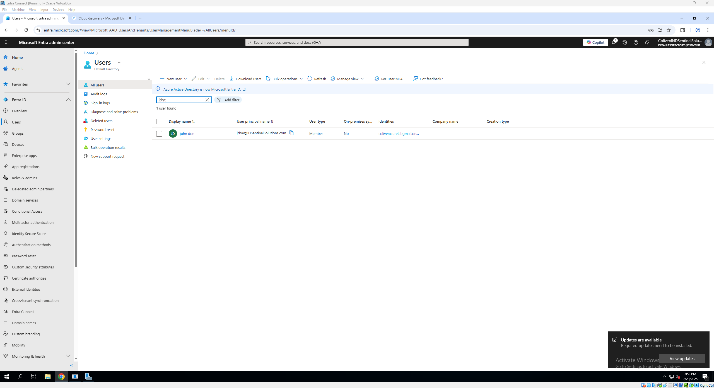

# 🛡️ Enterprise IAM Lab

Hands-on identity and access management (IAM) lab focused on Microsoft Entra ID, Okta, on-prem Active Directory, and identity federation protocols including SAML, SCIM, OAuth 2.0, and OpenID Connect.

---

This lab demonstrates how identity platforms are used in enterprise environments to manage access, enforce authentication policies, and integrate with cloud and on-prem applications. It includes secure provisioning, lifecycle management, access control, and automation using PowerShell and Okta Workflows.

---

## 📚 What This Lab Covers

- Microsoft Entra user and group provisioning (manual & scripted)
- Conditional Access and role-based access control
- Okta app integrations using SAML and OAuth 2.0
- Multi-Factor Authentication enforcement (Okta & Entra)
- Lifecycle and deprovisioning workflows
- Active Directory OU structure and GPOs
- Federation protocols: SAML, SCIM, OAuth, and OpenID Connect
- Identity automation using PowerShell and Okta Workflows

---

## 🗂️ Lab Modules

| Module | Description |
|--------|-------------|
| [Microsoft Entra ID](./entra/) | Cloud and hybrid identity provisioning, group-based licensing, Conditional Access (MFA, device compliance), PowerShell automation |
| [Okta](./okta/) | SAML/OIDC app integrations, MFA policies, JIT provisioning, lifecycle automation with Okta Workflows |
| [Active Directory (On-Prem)](./activedirectory/) | OU structure, GPOs, delegated access, user/group management with PowerShell|
| [Federation Protocols](./federation-protocols/) | SAML, SCIM, OAuth, and OIDC authentication flows |
| [Secure Access Controls](./secure-access/) | MFA policies, RBAC, Conditional Access enforcement |
| [Automation](./automation/) | IAM scripting with PowerShell and Okta Workflows |
| [Real-World Tasks](./real-world-tasks.md) | Work-based tasks mirrored in this lab |

---

## 🖥️ Lab Environment

| Component     | Detail                            |
|---------------|-----------------------------------|
| VMs           | Windows Server 2019, Windows 10   |
| Cloud Tenants | Microsoft 365 Developer Tenant, Okta Dev Edition |
| Domain        | IDSentinelSolutions.com (verified) |
| Tools         | PowerShell, GPMC, Postman, Okta Workflows |

---

## 🔧 Tools Used

- Microsoft Entra ID (Azure AD)
- Okta Identity Cloud
- Active Directory Domain Services (AD DS)
- Microsoft Entra Admin Center
- Azure AD Connect
- PowerShell
- Group Policy Management Console (GPMC)
- Okta Workflows
- Postman

---

## 🧪 Sample Use Cases

- ✅ Automatically create and license users in Entra
- ✅ Enforce MFA for Okta app sign-ins from untrusted devices
- ✅ Integrate GitHub SSO via SAML in Okta
- ✅ Create Conditional Access policies in Entra blocking legacy auth
- ✅ Build Okta Workflows for deactivation email alerts
- ✅ Use PowerShell to generate user activity and password expiry reports
- ✅ Apply GPOs to restrict user access to Control Panel
- ✅ Simulate OAuth flow using GitHub login to a static app

---

## 🚧 Coming Soon

- Entra SCIM connector simulation
- Defender for Identity integration with AD and Entra
- Hybrid Conditional Access for domain-joined machines
- Logic Apps + Azure Automation integration for identity orchestration

---

## 📸 Screenshots

| Description                    | Image |
|--------------------------------|-------|
| Entra User Provisioning        |  |
| Okta SAML Integration (GitHub) |  |
| Conditional Access Policy      |  |
| Okta MFA Enforcement           |  |

---

## 🔗 Links

- [My LinkedIn](https://www.linkedin.com/in/cleveland-oliver-iamsecurity)
- [IDSentinelSolutions.com](https://www.IDSentinelSolutions.com)
- [Hybrid AD + Entra Lab](https://github.com/ColiverSEC/AD-Entra-Hybrid-Lab)
- [Microsoft 365 Security Lab](https://github.com/ColiverSEC/Microsoft-365-Security-Lab)
