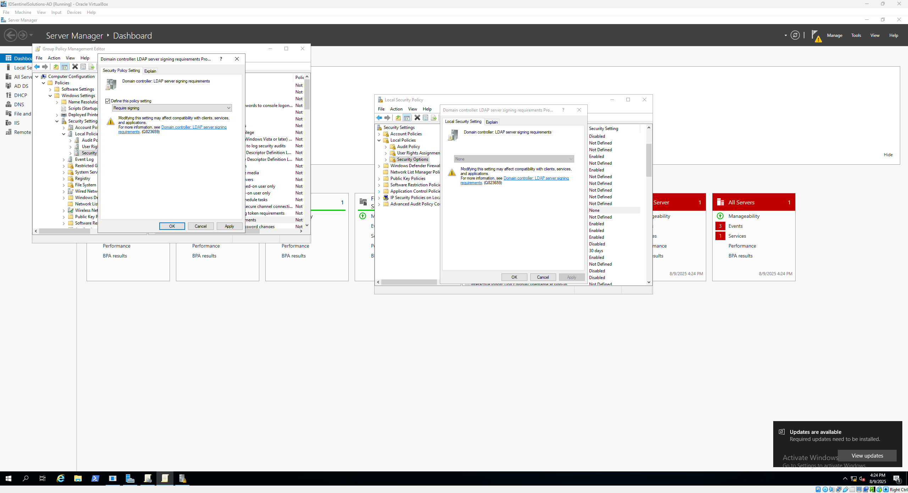

# 🛡️ Active Directory Security Hardening

⬅️ [Back to Active Directory (On-Prem) Lab Overview](./README.md)

This walkthrough guides you through fundamental security hardening practices for Active Directory: securing Domain Controllers, configuring advanced audit policies, and managing privileged accounts securely. These steps help protect your AD environment from common threats and ensure a strong security baseline.

---

## 📚 What This Lab Covers

- Securing Domain Controllers physically and logically  
- Configuring Local Security Policies on Domain Controllers  
- Enabling and fine-tuning Advanced Audit Policies  
- Managing privileged groups and accounts  
- Deploying Local Administrator Password Solution (LAPS) for local admin security  
- Monitoring audit logs for critical security events

---

## 📝 What You’ll Need

🔹 Windows Server 2019/2022 Domain Controller VM (with AD DS installed)

🔹 Windows 10 domain-joined VM (for testing audit logs and group membership)

🔹 Group Policy Management Console (GPMC) installed on your management machine

🔹 Administrative access to your AD environment

---

## 🔐 Step 1: Secure Domain Controllers

- Ensure physical security of DCs: restricted access, locked rooms, limited network exposure  
- Log into the Domain Controller and open **Local Security Policy** (`secpol.msc`)  
- Navigate to **Security Settings** → **Local Policies** → **Security Options**  
- Configure the following settings:  
  - **Network security: Restrict NTLM: Incoming NTLM traffic** → **Deny all**  
  - **Network security: Restrict NTLM: Outgoing NTLM traffic to remote servers** → **Deny all**  
  - **Domain controller: LDAP server signing requirements** → **Require signing**  
  - Limit **User Rights Assignment** such as who can log on locally to DCs

> 💡 Note: If the **Domain controller: LDAP server signing requirements** setting is greyed out, it is likely being enforced via **Group Policy**. You can view or change the setting in **Group Policy Management** under:
**Computer Configuration** → **Policies** → **Windows Settings** → **Security Settings** → **Local Policies** → **Security Options**.
> 
> *The warning about “modifying this setting may affect compatibility” is expected and should be reviewed before making changes.*

📸 **Screenshot:** Local Security Policy - Security Options

---

## 📊 Step 2: Harden Audit Policy

- Open **Group Policy Management Console (GPMC)**  
- Create or edit a GPO linked to the **Domain Controllers OU**  
- Navigate to:  
  `Computer Configuration → Policies → Windows Settings → Security Settings → Advanced Audit Policy Configuration → Audit Policies`  
- Enable **Success** and **Failure** auditing for:  
  - Account Logon  
  - Account Management  
  - Logon/Logoff  
  - Policy Change  
  - Privilege Use  
  - System  
  - Directory Service Access  
- Also enable auditing for Credential Validation and Kerberos Authentication  
- Run `gpupdate /force` on DCs to apply  
- Verify audit logs in **Event Viewer → Security Logs**  

📸 **Screenshot:**  

---

## 🛡️ Step 3: Manage Privileged Accounts

- Open **Active Directory Users and Computers (ADUC)**  
- Review membership of privileged groups: **Domain Admins**, **Enterprise Admins**, **Administrators**  
- Remove unnecessary members; use dedicated admin accounts for elevated tasks  
- Add critical accounts to **Protected Users** group to enforce security restrictions  
- Deploy Local Administrator Password Solution (LAPS):  
  - Install LAPS on DCs and management machines  
  - Create a GPO under `Computer Configuration → Policies → Administrative Templates → LAPS` to enable password management  
  - Verify local admin passwords rotate and are stored securely in AD  

📸 **Screenshot:**  

---

## 🔎 Step 4: Verify Hardening and Monitoring

- Review Event Viewer Security logs for key events (e.g., 4624, 4720, 4732, 4907)  
- Test that Protected Users group members cannot authenticate using NTLM  
- Confirm LAPS is rotating passwords properly  

---

## 🔄 Real-World Scenario Example

**Scenario:** Your organization recently experienced suspicious activity on several Domain Controllers. To improve security, you are tasked with hardening DCs and tightening control over privileged accounts.

**Tasks:**
- Restrict NTLM traffic on Domain Controllers to block legacy authentication methods  
- Enable advanced audit policies to log all account management and logon events  
- Review and reduce membership in privileged groups, removing inactive or unnecessary admin accounts  
- Deploy LAPS to rotate local administrator passwords automatically and reduce the risk of lateral movement  
- Add critical accounts to the Protected Users group to enforce stricter authentication policies  

**Outcome:**  
After implementing these controls, the security team receives detailed audit logs to quickly detect suspicious activity. Unauthorized access attempts are blocked, and compromised admin accounts are minimized. The risk of credential theft and lateral movement within the domain is significantly reduced, improving overall AD security posture.

📸 **Screenshot:**  

---

## ✅ Expected Behavior
- Domain Controllers enforce strict local security policies  
- Audit policies produce detailed security event logs  
- Privileged accounts are limited and secured with additional protections  
- Local admin passwords rotate automatically and are protected  

---

## 🔄 Optional Enhancements
- Deploy Privileged Access Workstations (PAWs) for admins  
- Implement Just-In-Time (JIT) and Just-Enough-Administration (JEA) models  
- Use SIEM tools for centralized log monitoring and alerting  

---

## 🔗 Next Steps

You have now strengthened your Active Directory security by securing DCs, hardening auditing, and managing privileged accounts.

➡️ [Continue to: User and Group Management](./user-and-group-management.md)  
➡️ [Continue to: Authentication Protocols in Active Directory](./authentication-protocols-in-active-directory.md)
