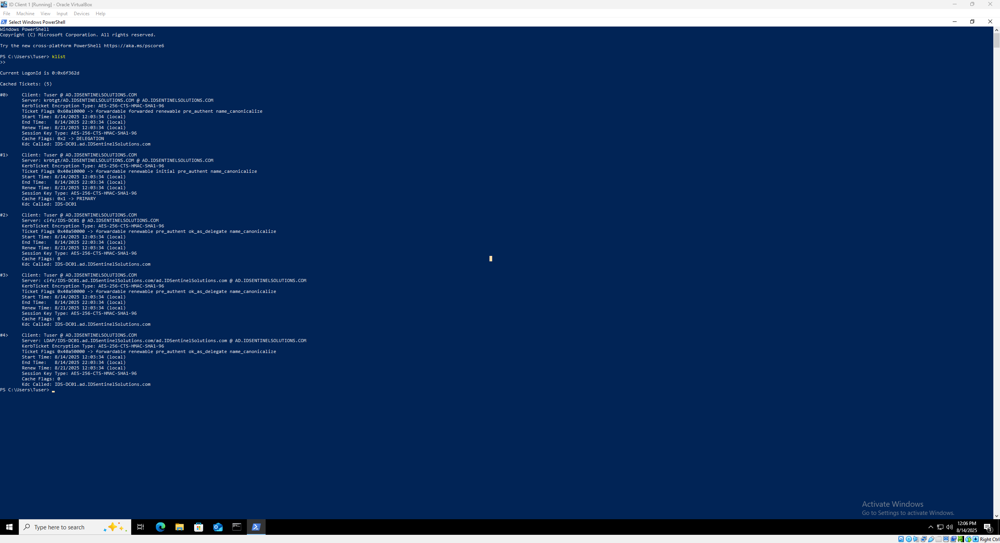

# 🛡️ Authentication Protocols in Active Directory

⬅️ [Back to Active Directory (On-Prem) Lab Overview](./README.md)

This walkthrough focuses on understanding and configuring authentication protocols in Windows Server Active Directory. You’ll learn how AD handles authentication with Kerberos, NTLM, and LDAP/LDAPS, and how to configure, test, and secure these protocols in a lab environment.

---

## 📚 What This Lab Covers

- Overview of authentication protocols in AD: Kerberos, NTLM, LDAP/LDAPS
- Configuring AD to use and enforce specific protocols
- Testing authentication from client machines
- Securing authentication traffic with LDAPS
- Understanding ticketing, delegation, and protocol flow
- Auditing and troubleshooting authentication

---

## 📝 What You’ll Need

🔹 Windows Server 2019 (or later) with AD DS installed

🔹 Windows 10/11 client (domain-joined)

🔹 Active Directory domain set up (e.g., `corp.lab`)

🔹 PowerShell (on DC or client with RSAT)

🔹 Optional: Wireshark for packet capture / protocol analysis

---

## 📖 Understanding AD Authentication Protocols (Concepts)

- **Kerberos**: Default authentication protocol in AD, uses tickets (TGT and Service Tickets)
- **NTLM**: Legacy protocol for backward compatibility; uses challenge/response hash
- **LDAP / LDAPS**: Directory access protocol; LDAPS encrypts traffic with SSL/TLS
- AD authentication is controlled by **policies, group membership, and SPNs**
> 💡 *Tip: Use klist to view Kerberos tickets on a client or nltest /sc_query:corp to test domain secure channel.*

---

## ⚠️ Common Pitfalls to Avoid

- **Relying on NTLM**: Only use if necessary; vulnerable to pass-the-hash attacks
- **Unencrypted LDAP**: Always prefer LDAPS for applications and services
- **Time synchronization issues**: Kerberos requires synchronized clocks (within 5 min by default)
- **SPN misconfiguration**: Can cause Kerberos authentication failures

---

## 🔧 Configure and Test Kerberos Authentication

### Step 1: Verify Kerberos Tickets
- Open PowerShell or Command Prompt on a client
- **Run**: `klist`
- You should see a TGT for your logged-in user

📸**Screenshot**: klist output showing TGT


### Step 2: Force Kerberos Authentication to a Service

- Connect to a network service using a domain account (e.g., file share)
- Use PowerShell to validate ticket usage:
 - **Run**: `klist tgt`

---

## 🔧 Configure and Test NTLM Authentication

### Step 3: Enable NTLM for a Specific Server (Optional)

- Open **Group Policy Management** → Domain Controllers Policy
- Navigate to **Computer Configuration** → **Policies** → **Windows Settings** → **Security Settings** → **Local Policies** → **Security Options**
- Check settings like **Network security: LAN Manager authentication level** and enable:
  - `Send LM & NTLM – use NTLMv2 session security if negotiated`
  - (Optional) `Network security: Do not store LAN Manager hash value on next password change` – should generally be enabled for security
- Apply policy with `gpupdate /force` if needed

### Step 4: Test NTLM Login

> 📒 **Note**: If you don’t already have Wireshark installed, [download](https://www.wireshark.org/download.html) it and install it before proceeding.

- **Prepare Your Lab Client**  
  - Log in as a standard domain user (not an admin)  
  - Open **PowerShell** on your lab client

- **Start Capturing Network Traffic**  
  - Open **Wireshark** on your lab client machine  
  - Select the network interface that connects to your lab domain controller  
  - Click **Start Capture**

- **Trigger NTLM Authentication**  
  - In **PowerShell**, run:  
    ```powershell
    dir \\IDS-DC01\C$
    ```  
  - Accessing the share will perform an NTLM handshake if Kerberos is not used or NTLM is allowed

- **Stop Capturing Traffic**  
  - Immediately after the directory listing completes, stop the capture in Wireshark

- **Filter for NTLM Traffic**  
  - In **Wireshark**, enter the filter:  
    ```
    ntlmssp
    ```  
  - To also see SMB context:  
    ```
    smb || ntlmssp
    ```  
  - This isolates packets related to NTLM authentication

- **Identify the NTLM Challenge/Response**  
  - Look for a **Negotiate / Challenge / Authenticate** sequence in the packet list  
  - This represents the NTLM handshake


📸 **Screenshot**: NTLM challenge/response captured in Wireshark

---

## 🔧 Configure LDAP / LDAPS Authentication

### Step 5: Enable LDAPS

> ⚠️ **Note:** If Active Directory Certificate Services (AD CS) isn’t installed, you’ll need to install it before importing a certificate.

- **Open Certificates MMC**
  - Press **Win + R**, type `mmc`, and press **Enter**
  - Go to **File → Add/Remove Snap-in**, select **Certificates**, click **Add**
  - Choose **Computer account → Local computer → Finish → OK**
- **Import SSL Certificate**
  - In **Certificates (Local Computer)**, expand **Personal → Certificates**
  - Right-click **Certificates → All Tasks → Request New Certificate**
  - Click **Next** → choose **Active Directory Enrollment Policy** → **Next**
  - Select the **Domain Controller** template → **Enroll** → **Finish**
- **Verify Certificate Properties**
  - Ensure the certificate: 
    - Is issued by a trusted CA (or your internal CA in the lab)
    - Contains the **Server Authentication EKU**
    - Has the **Subject** or **SAN** matching your Domain Controller’s FQDN.
  - Complete the import wizard and verify the certificate appears under **Personal → Certificates**
  - Certificate appears under **Personal** → **Certificates**
- **Restart AD DS Service**
  - Restart the **Active Directory Domain Services (AD DS)** service to enable LDAPS

📸 **Screenshot**: LDAPS query returning user object successfully

---

## 🔍 Verify and Audit Authentication

### Step 7: Check Event Logs

- Open **Event Viewer** → **Windows Logs** → **Security**
- Look for event IDs:
  - 4768: Kerberos TGT requested
  - 4769: Service ticket requested
  - 4624: Successful logon

### Step 8: Troubleshoot Failures

- Use `klist purge` to clear tickets
- Use `nltest /sc_verify:corp` to verify secure channel
- Check clock sync, SPNs, and user permissions

---

## 🔄 Real-World Scenario Example

**Scenario**: An application must authenticate to AD using Kerberos and failover to LDAPS if necessary.
- Verify client tickets using `klist`
- Test LDAPS connection using PowerShell
- Confirm NTLM fallback only occurs when necessary

📸 **Screenshot**: Kerberos and LDAPS authentication flow diagram

---

## ✅ Expected Behavior

- Kerberos is used by default for domain logons
- LDAPS secures application authentication
- NTLM is only used when legacy systems require it
- All authentication events are logged in Security Event Log for auditing

---

## 🔄 Optional Enhancements

- Configure constrained Kerberos delegation for specific services
- Capture and analyze authentication packets using Wireshark
- Enforce stronger NTLM policies or disable NTLM entirely


