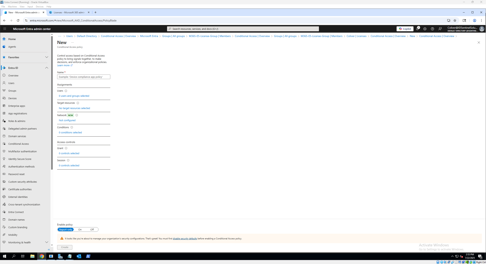
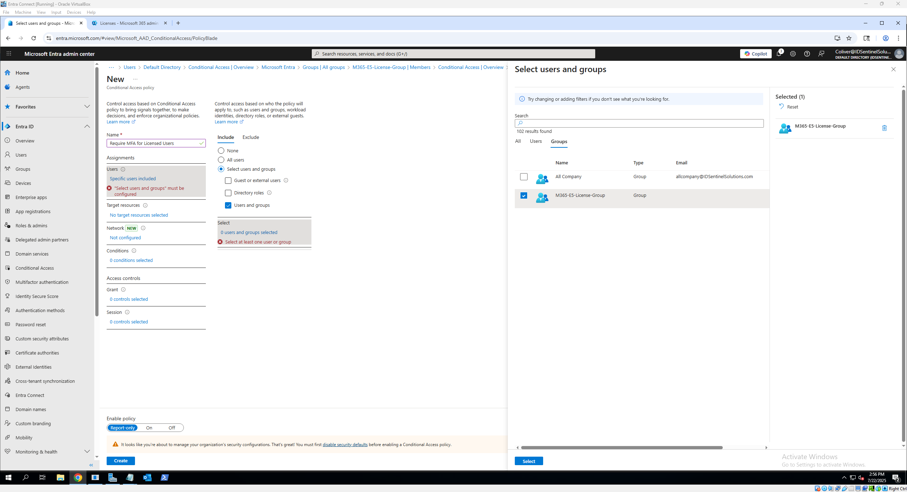
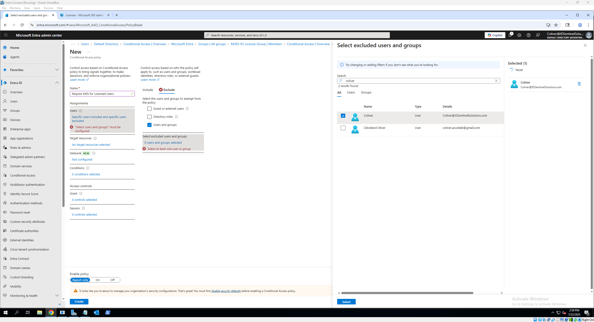
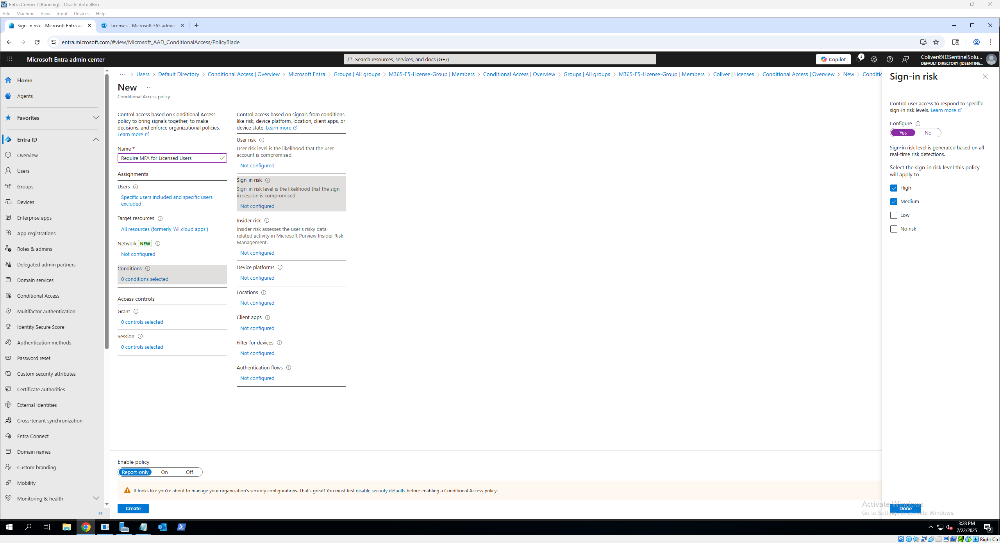
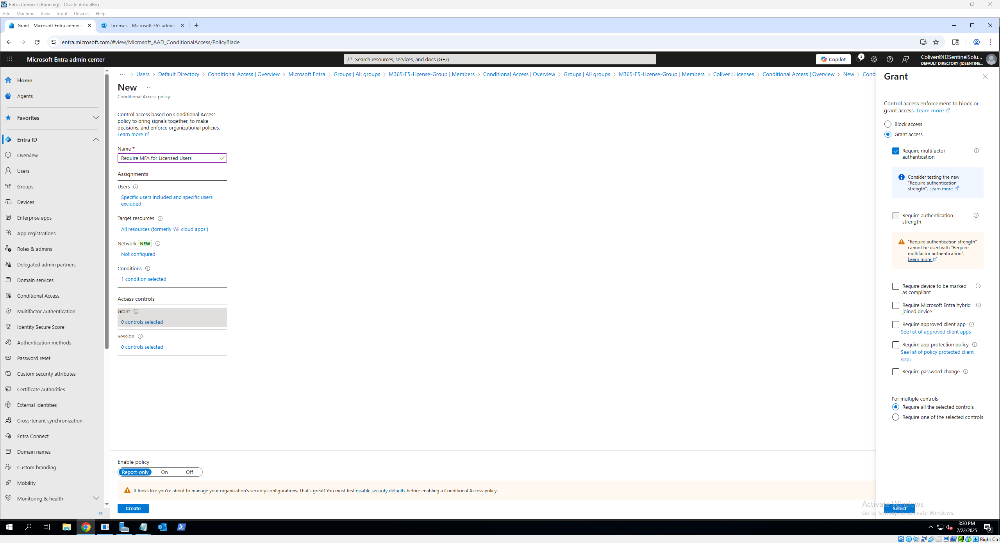
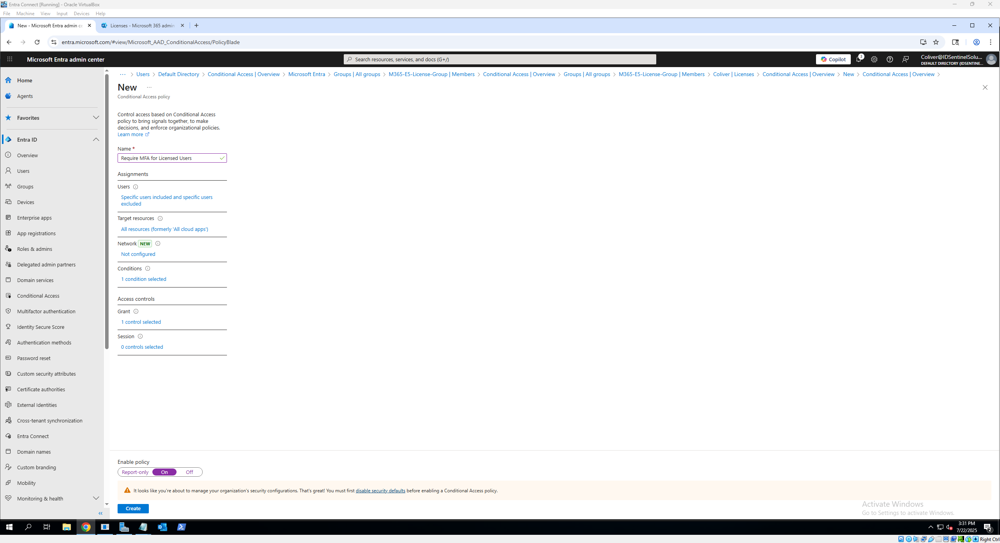

# 🔐 Microsoft Entra Conditional Access Policy Walkthrough

This section demonstrates how to create and test a Conditional Access policy in Microsoft Entra ID. The goal is to enforce Multi-Factor Authentication (MFA) under specific conditions, such as risky sign-ins or access to certain apps.

---

## 📝 What This Covers

- Creating a Conditional Access policy  
- Targeting specific users or groups  
- Configuring sign-in risk or location-based conditions  
- Requiring MFA as a control  

---

## 🛠️ How to Set It Up

### 1️⃣ Navigate to Conditional Access

- Go to **Microsoft Entra Admin Center**  
- Click **Entra ID tab** → **Conditional Access**  
- Click **+ Create New policy**

---

### 2️⃣ Define Policy Basics

- **Name**: `Require MFA for Licensed Users`

---

### 3️⃣ Select Users or Groups

- **Include**: `M365-E5-License-Group` *(or a test group you created earlier)*  
- **Exclude**: *(optional but recommended)*:
  - Your **Global Admin** account to prevent lockout  
  - Any **break-glass** accounts

---

### 4️⃣ Choose Cloud Apps or Actions

- **Select**: `Target resources`
- **Include**: `All resources (formerly 'All cloud apps')`  
  *(Or specify apps like Exchange Online, SharePoint, etc. if testing more narrowly)*

---

### 5️⃣ Configure Network (Optional for This Lab)

- **Select**: `Network location`
- This section allows you to **include or exclude access** based on:
  - IP address ranges (e.g., corporate network)
  - Named locations
  - Country/region  
- For this lab, **no network conditions will be applied**, but this is where you'd configure location-based rules in a real environment.
 

> 💡 Tip: Network controls are useful in production environments to block access from risky countries or allow only trusted IP ranges.

---

### 6️⃣ Configure Conditions *(optional)*

- **Sign-in risk**:
  - Trigger on: `Medium and above`  
  *(Requires Microsoft Entra ID P2 or Microsoft Defender for Identity)*

- **Location** *(optional)*:
  - Exclude trusted network locations if configured

---

### 7️⃣ Grant Access Controls

- Under **Grant**, choose:
  - ✅ `Require multi-factor authentication`  
  - Make sure “**Require all the selected controls**” is selected

---

### 8️⃣ Enable the Policy

- Set **Enable Policy** to: `On`  
- Click **Create** to save and apply the policy

---

## 🧪 Optional Testing Steps

You can validate the policy using the following steps:

1. Unassign MFA temporarily from your account in the **Microsoft 365 Admin Center**  
2. Confirm you're part of the `M365-E5-License-Group`  
3. Sign in from a new browser or incognito window  
4. Observe that MFA is triggered by the new Conditional Access policy

> ⚠️ **Important**: Always keep a backup Global Admin or break-glass account excluded from CA policies.

---

## ✅ Expected Behavior

- Users in the targeted group will be required to complete MFA based on the policy conditions  
- You can monitor enforcement results under:  
  **Microsoft Entra Admin Center** → *Monitoring* → *Sign-in Logs*

---

## 🔄 Optional Enhancements

- Add **named locations** to filter policy by geographic region or IP ranges  
- Add **client app filters** to exclude legacy authentication  
- Automate policy deployment using **PowerShell** or **Graph API**  
- Export policy definition as JSON for backup or versioning

---

> 💡 Want to trigger this policy based on device compliance?
> See: [Device Compliance Policy in Intune](https://github.com/ColiverSEC/Microsoft-365-Security-Lab/blob/main/Intune/device-compliance.md)

