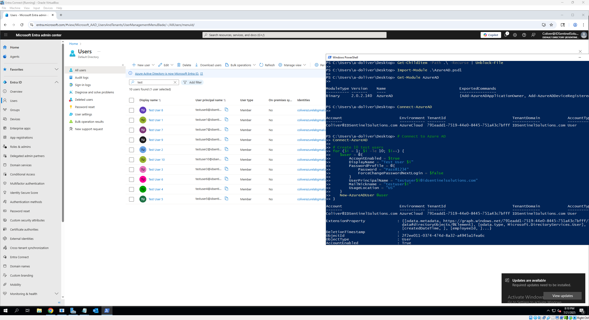
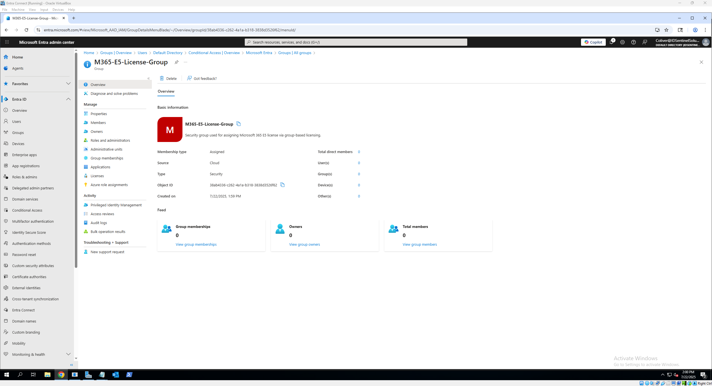
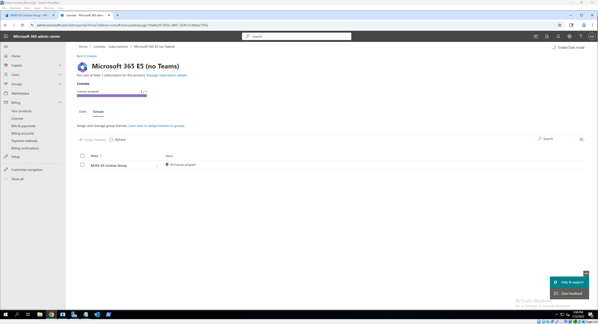
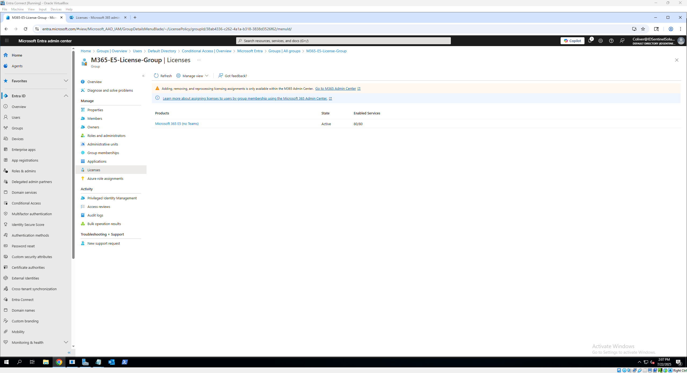
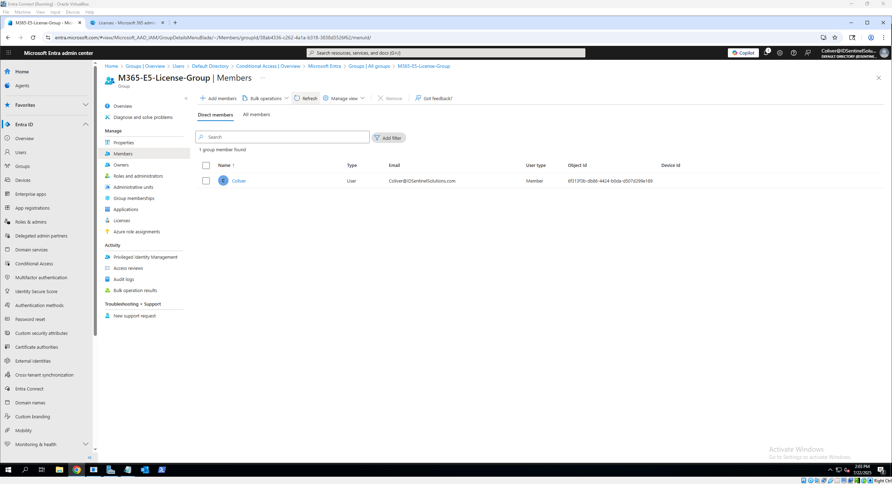

# 👤 Microsoft Entra User Provisioning

[⬅️ Back to Microsoft Entra ID Lab Overview](./README.md)

This section demonstrates how user identities are created and managed in Microsoft Entra ID. It includes direct user creation (manual and scripted), group-based license assignment, and syncing identities from on-prem Active Directory.

---

## 📚 What This Lab Covers

- Manual user creation in Entra Admin Center  
- Bulk user import with CSV  
- PowerShell automation for user creation  
- Group-based license assignment  

---

## 🧑‍💻 Manual User Creation (Cloud-Only)

- Go to **Microsoft Entra Admin Center** → **Users** → **New User** 
- Fill in basic info (Display Name, UPN, password)  
- Assign a **usage location**  
- Click **Create**

📸 Screenshots:


---

## 📂 Bulk Import via CSV

Microsoft Entra Admin Center supports bulk user creation using a CSV file.

### 📌 Steps to Upload

- Navigate to **Microsoft Entra Admin Center** → **Users** → **Bulk Create**
- Download the **sample CSV template** (optional but very helpful)
- Fill in your user details preferably in *Excel* or a *text editor*
- Upload your completed CSV file and **submit** the import

### 📄 Example CSV Format

```
version:v1.0
Name [displayName] Required,User name [userPrincipalName] Required,Initial password [passwordProfile] Required,Block sign in (Yes/No) [accountEnabled] Required,First name [givenName],Last name [surname],Job title [jobTitle],Department [department],Usage location [usageLocation],Street address [streetAddress],State or province [state],Country or region [country],Office [physicalDeliveryOfficeName],City [city],ZIP or postal code [postalCode],Office phone [telephoneNumber],Mobile phone [mobile]
Example: Chris Green, chris@contoso.com, myPassword1234, No
```

> ⚠️ **Important Notes:**
> - `UserPrincipalName` must use your verified domain (e.g., `@idsentinelsolutions.com`)
> - `UsageLocation` may be required depending on your tenant configuration
> - Passwords will be autogenerated unless specified through advanced templates

📸 **Screenshots:** 


📁 [Download Sample CSV](./scripts/bulk-upload.csv)

---

## ⚙️ PowerShell Automation for User Provisioning

Microsoft Entra supports user creation via PowerShell using the **AzureAD** or **Microsoft Graph** module. This lab uses `AzureAD` for simplicity.

> 🧠 **Note:** If this is your first time using PowerShell with Entra ID, make sure you install the AzureAD module and connect to your tenant first.
>
> 📁 [`install-azure-ad-module.ps1`](./scripts/install-azure-ad-module.ps1)
>
> ```powershell
> # Installs the AzureAD module if not already installed
> Install-Module -Name AzureAD -Force -Scope CurrentUser
>
> # Connect to your Microsoft Entra ID tenant
> Connect-AzureAD
> ```
Once connected, run the script to create users:

> 📁 [`entra-user-creation.ps1`](./scripts/entra-user-creation.ps1)
>
> ```powershell
># Connect to Azure AD
> Connect-AzureAD
>
> # Create 10 test users
> for ($i = 1; $i -le 10; $i++) {
>    $user = @{
>        AccountEnabled = $true
>        DisplayName = "Test User $i"
>        PasswordProfile = @{
>            Password = "Pass@1234"
>            ForceChangePasswordNextLogin = $false
>        }
>        UserPrincipalName = "testuser$i@idsentinelsolutions.com"
>        MailNickname = "testuser$i"
>        UsageLocation = "US"
>    }
>    New-AzureADUser @user
> }
> ```

📸 Screenshot: 


---

### ✅ Output

- Users appear in Entra ID as **cloud-only users**
- You can verify in the Entra Admin Center under *Users*

---

### 💡 Optional Extensions (for future versions of this lab)

- Bulk create from a `.csv` file
- Assign licenses or roles via PowerShell
- Add users to groups automatically

---

> 🔁 **Looking for hybrid sync setup?**
> Learn how to connect on-prem AD to Entra ID and sync thousands of users using Azure AD Connect.
>
> 👉 [Go to Hybrid Identity Walkthrough](./hybrid_identity.md)


---

## 👥 Group-Based License Assignment

Microsoft Entra allows licenses (such as Microsoft 365 E5) to be assigned automatically through **security groups** — making user onboarding faster and more scalable.

---

### 🧩 Why Use Group-Based Licensing?

- Eliminates manual license assignment for each user
- Automates licensing during onboarding
- Keeps compliance and cost under control
- Works with synced and cloud-only users

---

### 🛠️ How to Set It Up

**Create a Security Group**
- Go to **Microsoft Entra Admin Center** → *Groups* → *New Group*
   - Group type: `Security`
   - Name example: `M365-E5-License-Group`
   - Membership type: `Assigned` (for now)

**Assign a License to the Group**

   - After creating the group, go to **Licenses** → *All Products*
   - Click on a license (e.g., *Microsoft 365 E5*) → *Licensed Groups* → *Assign to Group*
   - Choose your security group (e.g., `M365-E5-License-Group`)
   - Enable the services you want → *Assign*

 **Add Users to the Group**

- Add users manually or via PowerShell
- Example:
  - ```powershell
     Add-AzureADGroupMember -ObjectId "<GroupObjectId>" -RefObjectId "<UserObjectId>"
     ```

---

### 📸 Screenshots:

**Group creation confirmation:**  

**License added to group in Admin Center:**

**License added and verfied in Entra:**

**User added to License Group confirmation:**


---

### ✅ What Happens Next?

- Any user added to the group **automatically inherits** the assigned license
- Removing the user from the group revokes the license
- This works with **both cloud-only and synced users**

---

### 🔄 Future Enhancements

- Convert the group to **Dynamic Membership** based on department or UPN
- Automate onboarding using **PowerShell or Logic Apps**

---

---

## ✅ Use Case Example: Onboarding a New Employee

This example walks through a real-world scenario using the tools configured in this lab.

### Scenario:
Your HR team hires a new employee who needs access to email, Teams, and SharePoint.

### 🔁 Steps Performed:

1. **User Provisioning**
   - The user is created in on-prem Active Directory or Entra ID using PowerShell or bulk CSV import.

2. **License Assignment**
   - The user is added to the `M365-E5-License-Group`, which automatically assigns Microsoft 365 E5 licensing.

3. **Access Control**
   - Conditional Access and MFA policies (covered next) apply based on group membership and device compliance.

---

### ✅ Outcome

- The user is fully licensed and appears in Entra ID  
- They can sign in to M365 services  
- Security and access policies are applied automatically  
- All without manual licensing or individual config

---

## 🔗 Next Steps

🎯 Now that users and groups are provisioned, you have two key next steps depending on your focus:

- If you want to **connect your on-prem AD to Microsoft Entra ID** and sync users, go to the Hybrid Identity walkthrough.  
  📁 [`hybrid-identity`](./hybrid-identity.md)

- If you’re ready to **secure access with Conditional Access policies**, continue here:  
  📁 [`conditional_access.md`](./conditional-access.md)


