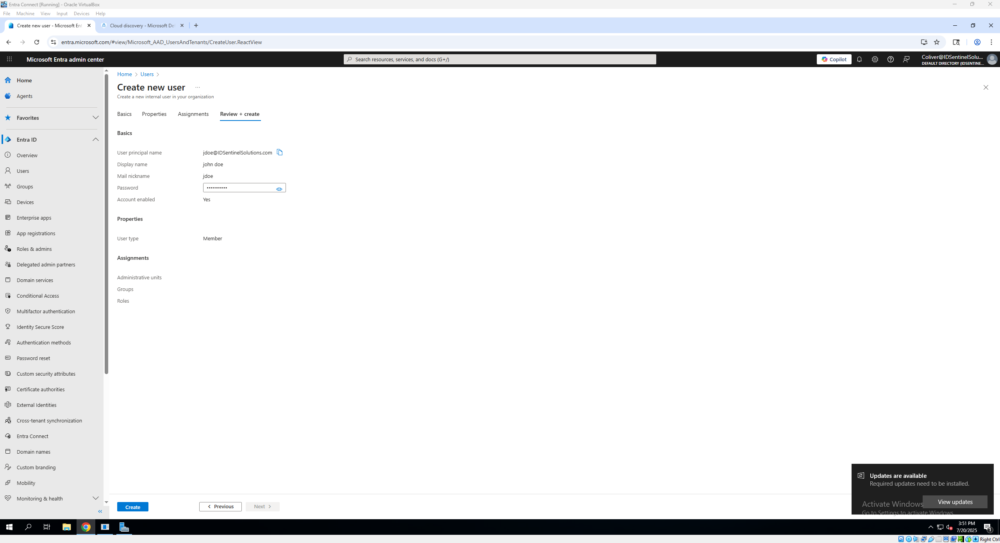
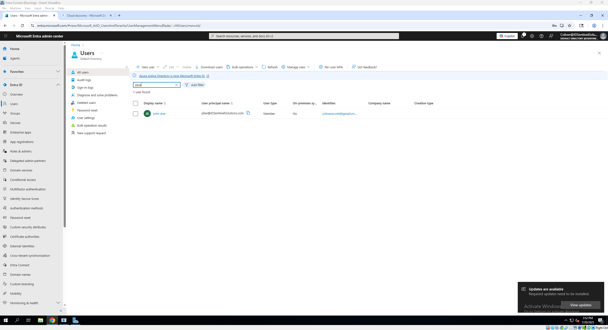
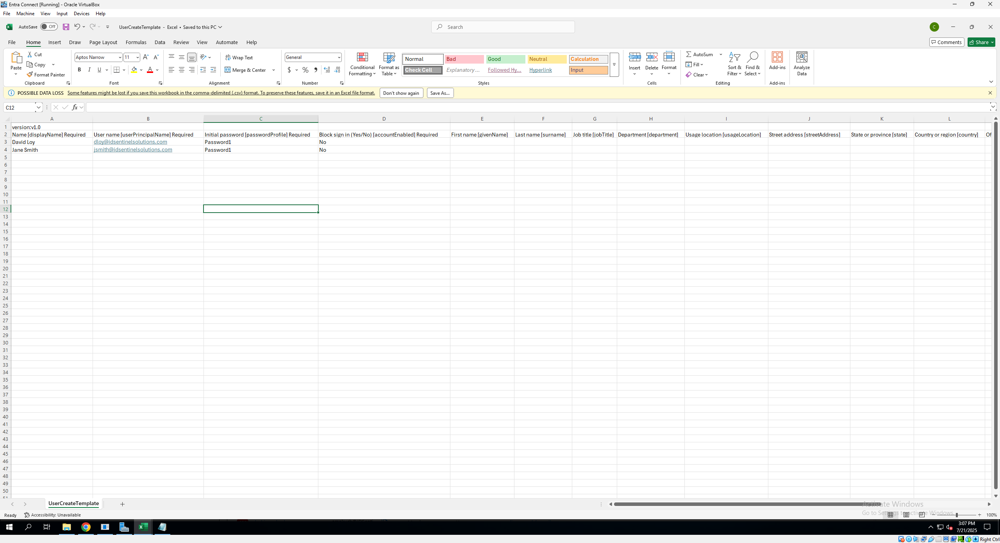
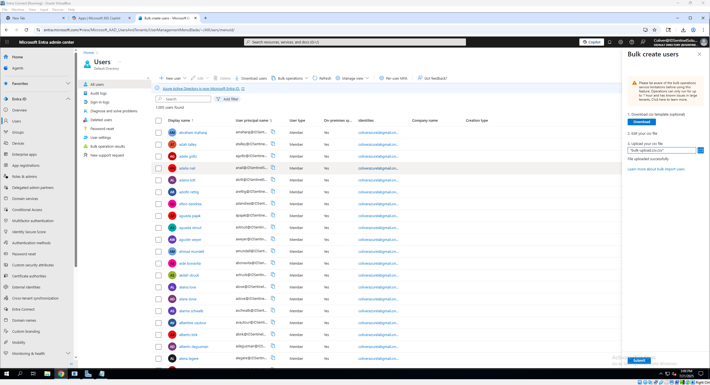
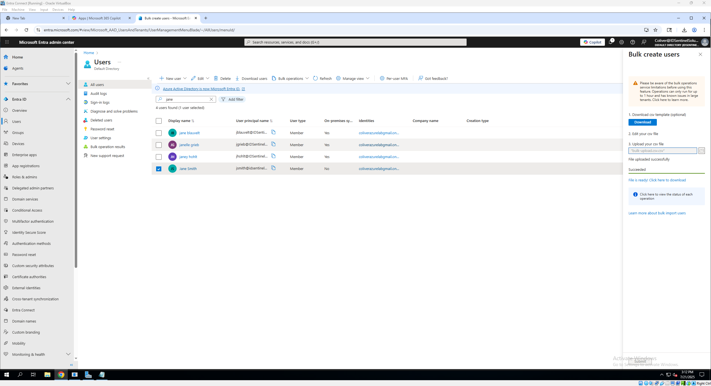

# 👤 Microsoft Entra User Provisioning

This section demonstrates how user identities are created and managed in Microsoft Entra ID. It includes direct user creation (manual and scripted), group-based license assignment, and syncing identities from on-prem Active Directory.

---

## 🔹 What This Covers

- Manual user creation in Entra Admin Center  
- Bulk user import with CSV  
- PowerShell automation for user creation  
- Entra ID Connect hybrid sync with on-prem AD  
- Group-based license assignment  

---

## 🧑‍💻 Manual User Creation (Cloud-Only)

1. Go to **Microsoft Entra Admin Center** → *Users* → *New User*  
2. Fill in basic info (Display Name, UPN, password)  
3. Assign a **usage location**  
4. Click *Create*

📸 Screenshots:  
 

---

## 📂 Bulk Import via CSV

Microsoft Entra Admin Center supports bulk user creation using a CSV file.

### 📌 Steps to Upload

1. Navigate to **Microsoft Entra Admin Center** → *Users* → *Bulk Create*
2. Download the **sample CSV template** (optional but very helpful)
3. Fill in your user details preferably in Excel or a text editor
4. Upload your completed CSV file and submit the import

### 📄 Example CSV Format

version:v1.0
Name [displayName] Required,User name [userPrincipalName] Required,Initial password [passwordProfile] Required,Block sign in (Yes/No) [accountEnabled] Required,First name [givenName],Last name [surname],Job title [jobTitle],Department [department],Usage location [usageLocation],Street address [streetAddress],State or province [state],Country or region [country],Office [physicalDeliveryOfficeName],City [city],ZIP or postal code [postalCode],Office phone [telephoneNumber],Mobile phone [mobile]
Example: Chris Green, chris@contoso.com, myPassword1234, No
```

> ⚠️ **Important Notes:**
> - `UserPrincipalName` must use your verified domain (e.g., `@idsentinelsolutions.com`)
> - `UsageLocation` may be required depending on your tenant configuration
> - Passwords will be autogenerated unless specified through advanced templates

📸 Screenshots: 



📁 [Download Sample CSV](./scripts/bulk-upload.csv)

---

## ⚙️ PowerShell Automation for User Provisioning

Microsoft Entra supports user creation via PowerShell using the **AzureAD** or **Microsoft Graph** module. This lab uses `AzureAD` for simplicity.

### 📁 Script Location  
[`entra/scripts/entra_user_creation.ps1`](./scripts/entra_user_creation.ps1)

### ▶️ Script Example: Create 10 Cloud-Only Users

```powershell
# Connect to Azure AD
Connect-AzureAD

# Create 10 test users
for ($i = 1; $i -le 10; $i++) {
    $user = @{
        AccountEnabled = $true
        DisplayName = "Test User $i"
        PasswordProfile = @{
            Password = "Pass@1234"
            ForceChangePasswordNextLogin = $false
        }
        UserPrincipalName = "testuser$i@idsentinelsolutions.com"
        MailNickname = "testuser$i"
        UsageLocation = "US"
    }
    New-AzureADUser @user
}
```

> 🧠 **Note:** Make sure you have the `AzureAD` module installed:
> ```powershell
> Install-Module -Name AzureAD
> ```

📸 Screenshot (optional):  
`entra/screenshots/powershell-user-create.png`

---

### ✅ Output

- Users appear in Entra ID as **cloud-only users**
- You can verify in the Entra Admin Center under *Users*

---

### 💡 Optional Extensions (for future versions of this lab)

- Bulk create from a `.csv` file
- Assign licenses or roles via PowerShell
- Add users to groups automatically

---

## 🔁 Hybrid Sync from On-Prem AD (via Azure AD Connect)

This lab builds on the configuration completed in my previous project:  
🔗 [AD-Entra-Hybrid-Lab](https://github.com/ColiverSEC/AD-Entra-Hybrid-Lab)

In that lab, I created a hybrid identity environment by connecting an on-prem Active Directory domain to Microsoft Entra ID using Azure AD Connect.

### 🧱 What Was Configured:

- **1,000 users** created in on-prem Active Directory using PowerShell
- **Organizational Units (OUs)** built for departments and devices
- **Custom domain** `IDSentinelSolutions.com` registered via GoDaddy and verified in Entra ID
- **Azure AD Connect** installed on a dedicated VM
- **Directory sync** configured between on-prem AD and Microsoft Entra

📸 Screenshot (user sync successful):  
`entra/screenshots/users-synced.png`

---

### 🔎 How to Verify Sync:

- Go to **Entra Admin Center → Users**
- Filter by **Source**: `Windows Server AD`
- You should see users marked as "Synced from on-premises AD"

💡 These users **cannot be edited** directly in Entra — changes must be made in Active Directory and synced.

---

### ✅ Why This Matters:

Hybrid identity allows organizations to:

- Maintain **existing on-prem environments**
- Extend security and access management into the **cloud**
- Enable **SSO**, **Conditional Access**, and **MFA** for synced users

---

📁 Learn more in the full walkthrough:  
🔗 [AD-Entra-Hybrid-Lab](https://github.com/ColiverSEC/AD-Entra-Hybrid-Lab)

---

## 👥 Group-Based License Assignment

Microsoft Entra allows licenses (such as Microsoft 365 E5) to be assigned automatically through **security groups** — making user onboarding faster and more scalable.

---

### 🧩 Why Use Group-Based Licensing?

- Eliminates manual license assignment for each user
- Automates licensing during onboarding
- Keeps compliance and cost under control
- Works with synced and cloud-only users

---

### 🛠️ How to Set It Up

1. **Create a Security Group**

   - Go to **Microsoft Entra Admin Center** → *Groups* → *New Group*
   - Group type: `Security`
   - Name example: `M365-E5-License-Group`
   - Membership type: `Assigned` (for now)

2. **Assign a License to the Group**

   - After creating the group, go to **Licenses** → *All Products*
   - Click on a license (e.g., *Microsoft 365 E5*) → *Licensed Groups* → *Assign to Group*
   - Choose your security group (e.g., `M365-E5-License-Group`)
   - Enable the services you want → *Assign*

3. **Add Users to the Group**

   - Add users manually or via PowerShell
   - Example:
     ```powershell
     Add-AzureADGroupMember -ObjectId "<GroupObjectId>" -RefObjectId "<UserObjectId>"
     ```

---

### 📸 Screenshot

Group license assignment confirmation:  
`entra/screenshots/group-assignment.png` *(Upload when available)*

---

### ✅ What Happens Next?

- Any user added to the group **automatically inherits** the assigned license
- Removing the user from the group revokes the license
- This works with **both cloud-only and synced users**

---

### 🔄 Future Enhancements

- Convert the group to **Dynamic Membership** based on department or UPN
- Automate onboarding using **PowerShell or Logic Apps**

---

---

## ✅ Use Case Example: Onboarding a New Employee

This example walks through a real-world scenario using the tools configured in this lab.

### Scenario:
Your HR team hires a new employee who needs access to email, Teams, and SharePoint.

### 🔁 Steps Performed:

1. **User Provisioning**
   - The user is created in on-prem Active Directory or Entra ID using PowerShell or bulk CSV import.

2. **License Assignment**
   - The user is added to the `M365-E5-License-Group`, which automatically assigns Microsoft 365 E5 licensing.

3. **Sync to Cloud (if hybrid)**
   - If the user was created in AD, they are synced to Microsoft Entra ID via Azure AD Connect.

4. **Access Control**
   - Conditional Access and MFA policies (covered next) apply based on group membership and device compliance.

---

### ✅ Outcome

- The user is fully licensed and appears in Entra ID  
- They can sign in to M365 services  
- Security and access policies are applied automatically  
- All without manual licensing or individual config

---

## 🔗 Next Step: Conditional Access Policies

🎯 Now that users and groups are provisioned, the next step is securing their access.

📁 Continue to: [`conditional_access.md`](./conditional_access.md)


