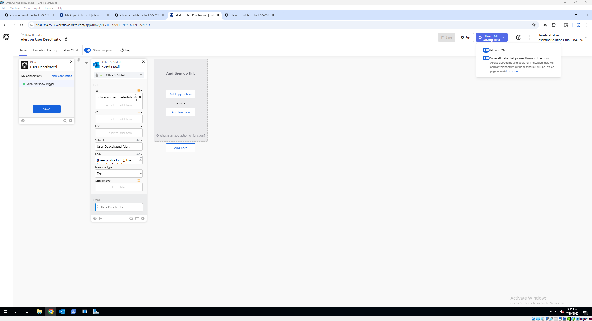

# 🔐 Okta IAM Lab

[⬅️ Back to Enterprise IAM Lab Overview](./README.md)

This module covers identity and access management using Okta, a leading cloud identity provider. It provides hands-on guidance to integrate applications with Okta via SAML and OIDC, configure Multi-Factor Authentication (MFA) policies, and automate user lifecycle management including provisioning and deprovisioning.

---

## 📚 What This Covers

- Application integration with Okta using SAML 2.0 and OpenID Connect (OIDC)  
- Setting up Single Sign-On (SSO) and Just-in-Time (JIT) provisioning  
- Enabling and enforcing Multi-Factor Authentication (MFA) with custom policies  
- Automating lifecycle management through provisioning, deactivation, and workflows  

---

## 📁 Lab Sections

- [`app-integration.md`](./app-integration.md)  
  ➤ Add and configure apps in Okta  
  ➤ Set up SAML or OIDC connections  
  ➤ Assign users/groups and test seamless SSO

- [`mfa-policies.md`](./mfa-policies.md)  
  ➤ Enable user factor enrollment  
  ➤ Create and customize authentication policies  
  ➤ Assign policies to users, groups, or specific applications  
  ➤ Verify MFA enforcement during sign-in

- [`lifecycle-management.md`](./lifecycle-management.md)  
  ➤ Enable provisioning and deprovisioning for connected apps  
  ➤ Map user attributes for syncing  
  ➤ Build Okta Workflows to automate notifications and lifecycle actions  

---

## 🗂 Folder Structure

| Folder | Contents |
|--------|----------|
| [`screenshots`](./screenshots) | Visual aids to accompany walkthrough steps for easier understanding |

---

## 🛠 Tools Used

- Okta Admin Console  
- Okta Workflows  
- SAML 2.0 / OIDC-compatible apps (e.g., GitHub, demo apps)  
- Browser with incognito mode for testing  

---

## 🔗 Related Labs

- [Microsoft Entra ID Lab](../entra/README.md) – Cloud identity and access management with Azure AD  
- [AD-Entra-Hybrid-Lab](https://github.com/ColiverSEC/AD-Entra-Hybrid-Lab/blob/main/README.md) – On-premises domain, group management and cloud sync
- [Federation Protocols](../federation-protocols/README.md) – Deep dive into SAML, SCIM, OAuth, and OpenID Connect  

---

## 🧪 Sample Use Cases

- ✅ Integrate enterprise applications with Okta for centralized access  
- ✅ Enforce step-up authentication for sensitive apps via MFA policies  
- ✅ Automate user provisioning to reduce manual overhead and errors  
- ✅ Monitor sign-in behavior and audit access events in Okta  

---

## 🚧 Coming Soon

- Advanced adaptive MFA using device and network context  
- Deep dive into Okta Workflows automation examples  
- Hybrid federation with Microsoft Entra and Okta  

---

## 📸 Screenshots

| Description                      | Image |
|---------------------------------|-------|
| Okta SAML Application Setup     |   |
| MFA Policy Creation              |  |
| Lifecycle Management Provisioning|  |

---

