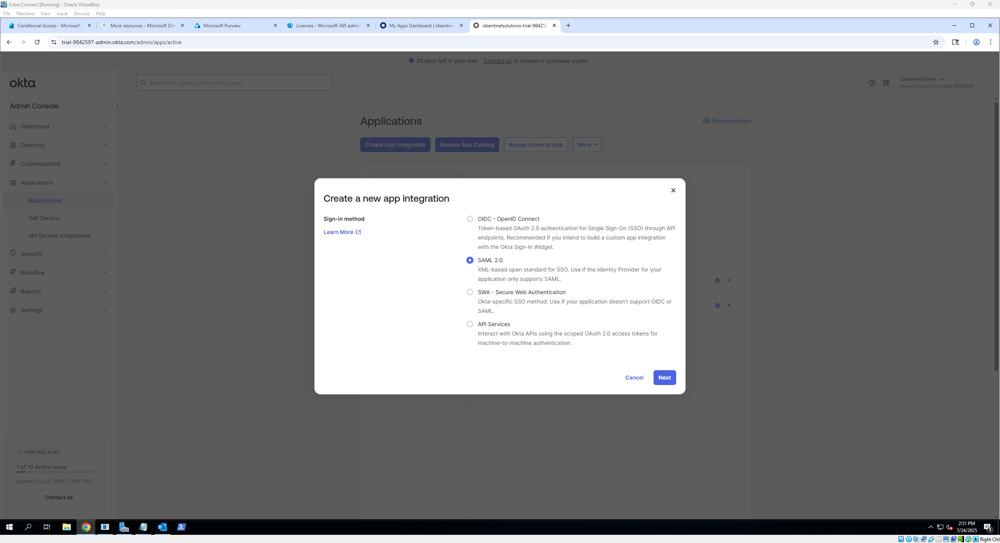
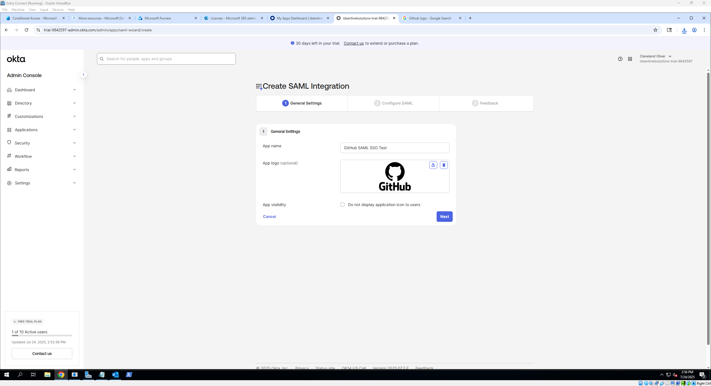
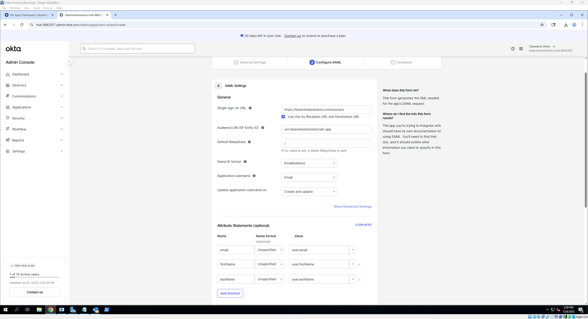
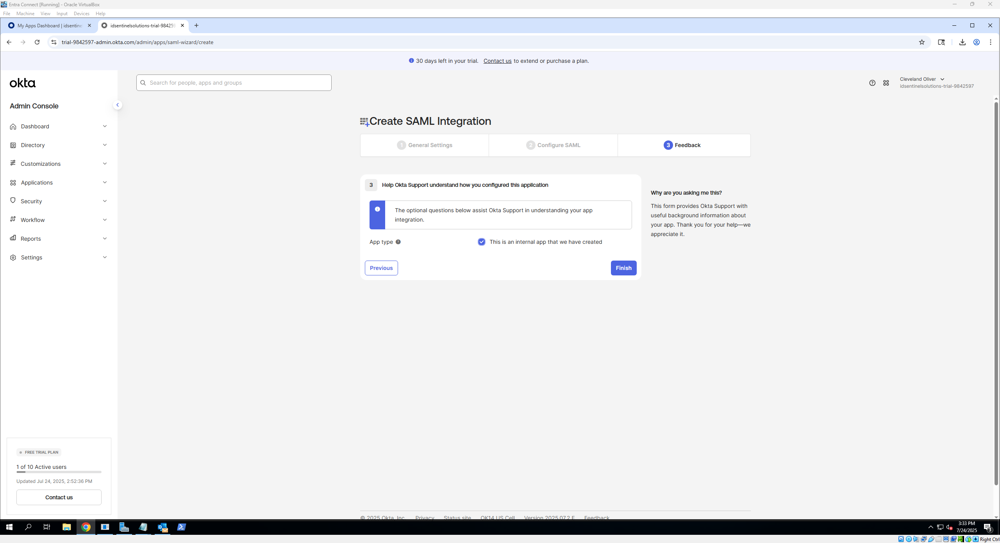
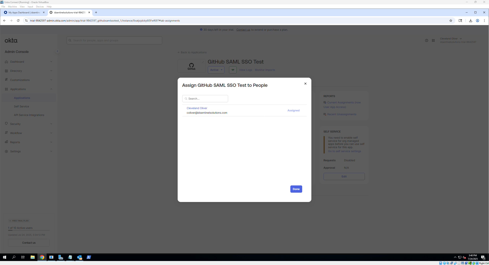
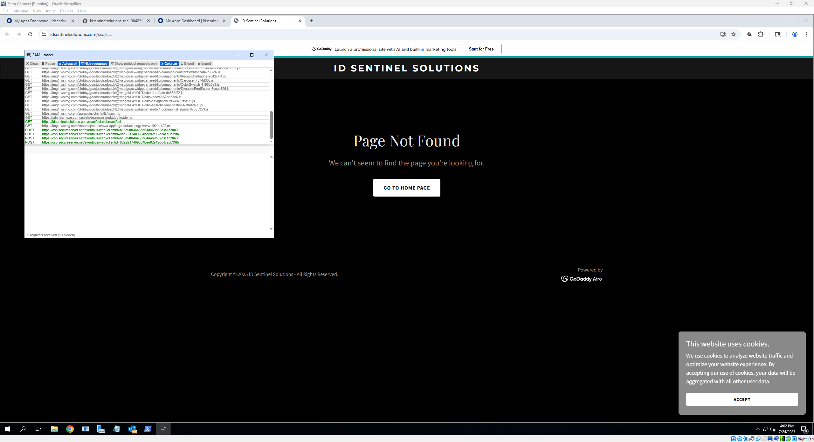

# 🔗 Okta Application Integration Walkthrough

### Introduction

This walkthrough guides you step-by-step through integrating an application with Okta using the SAML 2.0 and OpenID Connect (OIDC) protocols. You will learn how to add and configure an app in Okta, assign users for access, and test Single Sign-On (SSO) functionality. The guide also touches on Just-In-Time (JIT) provisioning to automate user account creation on the app side.

---

### What You’ll Need

#### 🔹 For SAML Integration
- Admin access to the Okta Admin Console  
- A test user account in Okta to assign the app  
- Application-specific information from the service provider (IdP metadata), including:  
  - Single Sign-On URL (ACS URL)  
  - Audience URI (SP Entity ID)  
  - Supported Name ID format and attributes  

#### 🔹 For OIDC Integration
- Admin access to the Okta Admin Console  
- A test user account in Okta to assign the app  
- Application details including:  
  - Redirect URI(s) for your app (where Okta sends tokens)  
  - Client ID and Client Secret (provided after app creation)  
  - Scopes and claims required by the app for authentication and profile data  

## 📝 What This Covers
- Adding apps to Okta
- Configuring SAML and OIDC settings
- Assigning users and testing SSO
- Just-in-Time (JIT) provisioning basics

---

## 🔍 Quick Overview: SAML and OIDC

When integrating applications with Okta, two common protocols are used to enable Single Sign-On (SSO): **SAML** and **OIDC**.

- **SAML (Security Assertion Markup Language)** is an XML-based standard widely used for enterprise web applications. It allows Okta to securely share authentication information with apps so users can sign in once and access multiple services without re-entering credentials.

- **OIDC (OpenID Connect)** is a modern, REST/JSON-based protocol built on top of OAuth 2.0. It’s commonly used for mobile and web applications and provides both authentication and user profile information through secure tokens.

Both protocols help improve security and user experience by allowing seamless access to multiple applications after a single Okta login.

---

## 💡 Note on Just-In-Time (JIT) Provisioning

JIT provisioning allows Okta to automatically create or update user accounts in the target application the moment a user signs in for the first time. This reduces administrative overhead by avoiding manual account creation and helps ensure users always have timely access.

---

## 🛠️ How to Set It Up: SAML

1. **Add a New App in Okta**
   - Navigate to the Okta Admin Console
   - Go to **Applications** → **Applications** → click *Create App Integration*.
   - Choose the appropriate sign-in method:
     - **SAML 2.0** for enterprise web apps.
     - **OIDC** - Web Application for modern or public-facing apps.
   - Click **Next**, then provide:
     - A name for your app (e.g., “GitHub SSO Test”).
     - Optionally, upload an app logo for easier identification.
   - Click **Next** to proceed to the configuration screen.

📸 **Screenshots**: 

 

---
  
2. **Configure SAML Settings**
   - **For SAML 2.0:**
   - Input required fields:
      - **Single Sign-On URL (SSO URL)** – where Okta will send the authentication response.
      - **Audience URI (SP Entity ID)** – unique identifier for the app.
      - **Default RelayState** - It tells Okta where to redirect users after successful SSO login. leave it blank or put / if you want to redirect to your site’s root URL.
      - **Name ID Format** - This defines how the user’s identifier is sent in the SAML assertion. For most apps, the default or *EmailAddress* format works best.
      - **Application Username** - This determines which Okta user profile attribute is sent as the NameID. Typically, use *Email* here.
      - **Update Application Username on** - This controls when Okta updates the username in the SAML assertion after the user profile changes.
> - **📒 Optional:** Enable JIT Provisioning by including required attributes (like email) and ensuring the app supports it

📸 **Screenshots**: 

---
  
3. **Assign the App to a Test User**
   - Go to **Assignments** → click **Assign** → choose **Assign to People** or **Groups**.
   - Select a test user (or group), confirm the user details, and click **Save and Go Back** → **Done**.
   - This ensures the user has access and can initiate the login flow.

📸 **Screenshots**: 

---

4. **Test the SSO Flow**
   - Open a new browser/incognito window.
   - Log in as the assigned test user.
   - Access the app directly or through the **Okta Dashboard**.
   - Confirm:
     - You’re redirected to the app without re-authenticating.
     - User profile attributes are passed correctly (check via developer tools or app-side logs).
     - You can use browser dev tools or SAML-tracer (which was used for this lab) to inspect the SAML assertion.

📸 **Screenshots**: 

---

## 🛠️ How to Set It Up: OIDC

1. **Add a New App in Okta**
   - Navigate to the Okta Admin Console
   - Go to **Applications** → **Applications** → click *Create App Integration*.
   - Choose the appropriate sign-in method:
     - **SAML 2.0** for enterprise web apps.
     - **OIDC** - Web Application for modern or public-facing apps.
   - Click **Next**, then provide:
     - A name for your app (e.g., “GitHub SSO Test”).
     - Optionally, upload an app logo for easier identification.
   - Click **Next** to proceed to the configuration screen.
  
2. **Configure SAML Settings**
   - **For SAML 2.0:**
   - Input required fields:
      - **Single Sign-On URL (SSO URL)** – where Okta will send the authentication response.
      - **Audience URI (SP Entity ID)** – unique identifier for the app.
      - **Default RelayState** - It tells Okta where to redirect users after successful SSO login. leave it blank or put / if you want to redirect to your site’s root URL.
      - **Name ID Format** - This defines how the user’s identifier is sent in the SAML assertion. For most apps, the default or *EmailAddress* format works best.
      - **Application Username** - This determines which Okta user profile attribute is sent as the NameID. Typically, use *Email* here.
      - **Update Application Username on** - This controls when Okta updates the username in the SAML assertion after the user profile changes.
> - **📒 Optional:** Enable JIT Provisioning by including required attributes (like email) and ensuring the app supports it
  
3. **Assign the App to a Test User**
   - Go to **Assignments** → click **Assign** → choose **Assign to People** or **Groups**.
   - Select a test user (or group), confirm the user details, and click **Save and Go Back** → **Done**.
   - This ensures the user has access and can initiate the login flow.

4. **Test the SSO Flow**
   - Open a new browser/incognito window.
   - Log in as the assigned test user.
   - Access the app directly or through the **Okta Dashboard**.
   - Confirm:
     - You’re redirected to the app without re-authenticating.
     - User profile attributes are passed correctly (check via developer tools or app-side logs).
     - You can use browser dev tools or SAML-tracer (which was used for this lab) to inspect the SAML assertion.

## ✅ Expected Behavior
- SSO should successfully authenticate assigned users into the app  
- Users should not be prompted for credentials after Okta login  
- Okta logs each authentication event in the **System Log**

---

## 🔗 Next Steps
- Continue to the [MFA Policy Configuration](./mfa-policies.md)  
- Or explore [Lifecycle Management Walkthrough](./lifecycle-management.md)
