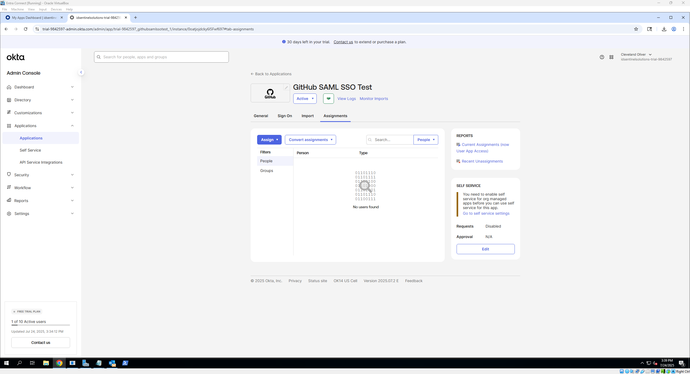
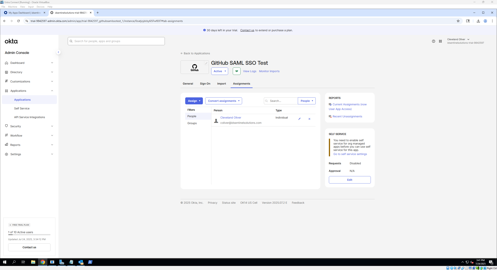
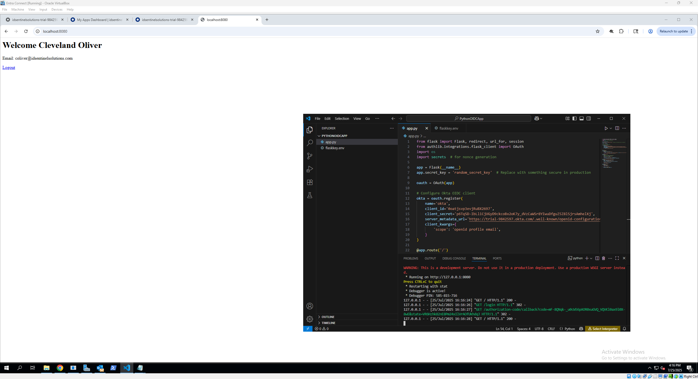

# 🔗 Okta Application Integration Walkthrough

### Introduction

This walkthrough guides you step-by-step through integrating an application with Okta using the SAML 2.0 and OpenID Connect (OIDC) protocols. You will learn how to add and configure an app in Okta, assign users for access, and test Single Sign-On (SSO) functionality. The guide also touches on Just-In-Time (JIT) provisioning to automate user account creation on the app side.

## 📚 Table of Contents
- [🔍 Overview](#-okta-application-integration-walkthrough)  
- [🛠️ SAML Setup](#️-how-to-set-it-up-saml)  
- [🛠️ OIDC Setup](#️-how-to-set-it-up-oidc)  
- [💡 JIT Provisioning](#-just-in-time-jit-provisioning-coming-soon) 
- [✅ Success & Next Steps](#-success-criteria)

---

### What You’ll Need

#### 🔹 For SAML Integration
- Admin access to the Okta Admin Console  
- A test user account in Okta to assign the app  
- Application-specific information from the service provider (IdP metadata), including:  
  - Single Sign-On URL (ACS URL)  
  - Audience URI (SP Entity ID)  
  - Supported Name ID format and attributes  

#### 🔹 For OIDC Integration
- Admin access to the Okta Admin Console  
- A test user account in Okta to assign the app  
- Application details including:  
  - Redirect URI(s) for your app (where Okta sends tokens)  
  - Client ID and Client Secret (provided after app creation)  
  - Scopes and claims required by the app for authentication and profile data  


## 📝 What This Covers
- Adding apps to Okta
- Configuring SAML and OIDC settings
- Assigning users and testing SSO
- Just-in-Time (JIT) provisioning basics

---

## 🔍 Quick Overview: SAML and OIDC

When integrating applications with Okta, two common protocols are used to enable Single Sign-On (SSO): **SAML** and **OIDC**.

- **SAML (Security Assertion Markup Language)** is an XML-based standard widely used for enterprise web applications. It allows Okta to securely share authentication information with apps so users can sign in once and access multiple services without re-entering credentials.

- **OIDC (OpenID Connect)** is a modern, REST/JSON-based protocol built on top of OAuth 2.0. It’s commonly used for mobile and web applications and provides both authentication and user profile information through secure tokens.

Both protocols help improve security and user experience by allowing seamless access to multiple applications after a single Okta login.

---

## 💡 Note on Just-In-Time (JIT) Provisioning

JIT provisioning allows Okta to automatically create or update user accounts in the target application the moment a user signs in for the first time. This reduces administrative overhead by avoiding manual account creation and helps ensure users always have timely access.

---

## 🛠️ How to Set It Up: SAML

1. **Add a New App in Okta**
- Navigate to the Okta Admin Console
- Go to **Applications** → **Applications** → click *Create App Integration*.
- Choose the appropriate sign-in method:
  - **SAML 2.0** for enterprise web apps.
- Click **Next**, then provide:
  - A name for your app (e.g., “GitHub SSO Test”).
  - Optionally, upload an app logo for easier identification.
- Click **Next** to proceed to the configuration screen.

📸 **Screenshots**: 

 

---
  
2. **Configure SAML Settings**
- **For SAML 2.0:**
- Input required fields:
  - **Single Sign-On URL (SSO URL)** – where Okta will send the authentication response.
  - **Audience URI (SP Entity ID)** – unique identifier for the app.
  - **Default RelayState** - It tells Okta where to redirect users after successful SSO login. leave it blank or put / if you want to redirect to your site’s root URL.
  - **Name ID Format** - This defines how the user’s identifier is sent in the SAML assertion. For most apps, the default or *EmailAddress* format works best.
  - **Application Username** - This determines which Okta user profile attribute is sent as the NameID. Typically, use *Email* here.
  - **Update Application Username on** - This controls when Okta updates the username in the SAML assertion after the user profile changes.
> - **📒 Optional:** Enable JIT Provisioning by including required attributes (like email) and ensuring the app supports it

📸 **Screenshots**: 


---
  
3. **Assign the App to a Test User**
- Go to **Assignments** → click **Assign** → choose **Assign to People** or **Groups**.
- Select a test user (or group), confirm the user details, and click **Save and Go Back** → **Done**.
  - This ensures the user has access and can initiate the login flow.

📸 **Screenshots**: 




---

4. **Test the SSO Flow**
- Open a new browser/incognito window.
- Log in as the assigned test user.
- Access the app directly or through the **Okta Dashboard**.
  - Confirm:
    - You’re redirected to the app without re-authenticating.
    - User profile attributes are passed correctly (check via developer tools or app-side logs).
    - You can use browser dev tools or SAML-tracer (which was used for this lab) to inspect the SAML assertion.

📸 **Screenshot**: 


## 🎯 Results

- The assigned user can seamlessly authenticate via Okta SSO, with attributes passed correctly and accounts auto-provisioned if JIT is enabled.

---

## 🛠️ How to Set It Up: OIDC

1. **Add a New App in Okta**
- Navigate to the Okta Admin Console
- Go to **Applications** → **Applications** → click *Create App Integration*.
- Choose : **OIDC** - Web Application for modern or public-facing apps. 
  - select **App Type**:
    - **Web Application**: For server-side apps that can keep a client secret secure (e.g., traditional web servers).
    - **Single Page Application (SPA)**: JavaScript apps running in browsers that cannot securely keep a client secret.
    - **Native Application**: Mobile or desktop apps installed on a device 
- Click **Next** to proceed to the configuration screen.

📸 **Screenshot**: 


---
     
2. **Configure OIDC Settings**
- Fill in the following:
  - A name for your app (e.g., “GitHub SSO Test”).
  - Optionally, upload an app logo for easier identification.
  - **Sign-in redirect URIs**: This is where Okta sends users after login.
  - **Sign-out redirect URIs**: (Optional) Where users are sent after logout.
  - **Trusted Origins:** (Optional but recommended) Add your domain to Trusted Origins for CORS support.

📸 **Screenshot**: 


---
  
3. **Assign the App to a Test User**
- Go to **Assignments** → click **Assign** → choose **Assign to People** or **Groups**.
- Select a test user (or group), confirm the user details, → click **Save and Go Back** → **Done**.
  - This ensures the user has access and can initiate the login flow.

📸 **Screenshots**: 


---

4. **Grab Credentials**
- After saving, Okta generates a Client ID and Client Secret.
- Go to **Applications** → **Applications** → click *Your Created App* → **General**
- You’ll then see your credentials and You’ll use these in your app to request tokens.

📸 **Screenshot**: 


---

5. **Set Up Your Application to Use OIDC**
> ‼️Important‼️
> 
> Your app needs to:
>  - Redirect users to Okta’s authorization endpoint.
>  - Handle the callback on the redirect URI.
>  - Exchange the authorization code for tokens using client ID/secret.
>  - Validate tokens and extract user info.
>> 🔑 What was used:
>> - **Used Visual Studio Code (VS Code)** as the code editor and terminal for running the app locally.[Link to install Visual Studio Code](https://code.visualstudio.com/Download)
>> - Installed **Python 3.13** (or used embedded Python) on Windows. [Link to download Python](https://www.python.org/downloads/windows/)
>> - Installed required Python packages using **pip**:
>> ``` pip install flask authlib python-dotenv ```
>> - Create a working folder (e.g., `C:\Users\a-doliver\PythonOIDCApp`)
- After installing the necessary tools, you will need to create a python script in Visual Studio Code (VSC):
  - While in VSC → click **Open Folder** and navigate to the target folder → right click in the **Explorer** tab → create **New File** named *app.py*
  - In the *app_py* file paste the following → **Save**:
    
```
from flask import Flask, redirect, url_for, session
from authlib.integrations.flask_client import OAuth
import os
import secrets  # for nonce generation

app = Flask(__name__)
app.secret_key = 'random_secret_key'  # Replace with something secure in production

oauth = OAuth(app)

# Configure Okta OIDC client
okta = oauth.register(
    name='okta',
    client_id='YOUR_CLIENT_ID',
    client_secret='YOUR_CLIENT_SECRET',
    server_metadata_url='https://trial-9842597.okta.com/.well-known/openid-configuration',
    client_kwargs={
        'scope': 'openid profile email',
    }
)

@app.route('/')
def homepage():
    user = dict(session).get('user')
    if user:
        return f"<h1>Welcome {user['name']}</h1><p>Email: {user['email']}</p><a href='/logout'>Logout</a>"
    return '<a href="/login">Login with Okta</a>'

@app.route('/login')
def login():
    # Generate nonce and store in session
    nonce = secrets.token_urlsafe(16)
    session['nonce'] = nonce

    redirect_uri = url_for('auth', _external=True)
    return okta.authorize_redirect(redirect_uri, nonce=nonce)

@app.route('/authorization-code/callback')
def auth():
    token = okta.authorize_access_token()
    nonce = session.get('nonce')
    user_info = okta.parse_id_token(token, nonce=nonce)

    session['user'] = user_info
    return redirect('/')

@app.route('/logout')
def logout():
    session.clear()
    return redirect('/')

if __name__ == '__main__':
    app.run(port=8080, debug=True)
```
📌 Replace These Placeholders:
- `YOUR_CLIENT_ID` → Your client ID from the Okta app settings  
- `YOUR_CLIENT_SECRET` → Your client secret from the Okta app  
- `https://trial-9842597.okta.com` → Your Okta domain (if different)

---


6. **Run the Flask App**
- Open Terminal by → clicking  **View** → click **Terminal** or press **Ctrl + `** (make sure you're in the same folder as app.py):
  - Example command cd /path/to/your/folder
- Once you're in the target folder run ``` .\python.exe app.py ```
- you should see an output similar to ``` * Running on http://127.0.0.1:8080/ ```

📸 **Screenshot**: 


---

7. **Test It**
- Open your browser and go to: ``` http://localhost:8080 ```
- Click **Login with Okta**.
- You will be redirected to your Okta trial login screen.
- Sign in with a test user (create users in the Okta admin panel if needed).
- After successful login, you'll be redirected back to your app.
- The app will display the user's name and email.
💡 Tip: If the page doesn’t load after login, check your redirect URI in Okta and ensure it matches `http://localhost:8080/authorization-code/callback`

📸 **Screenshots**: 



## 🎯 Results

- The test user can log in through Okta OIDC, with tokens successfully received and user info displayed by the app, confirming correct integration and optional JIT provisioning.

---

## ⚡ Just-In-Time (JIT) Provisioning (Coming Soon)
Just-In-Time (JIT) provisioning enables automatic user creation during their first login through SSO, streamlining access without pre-provisioning. This section will cover how to configure JIT provisioning with Microsoft Entra ID and SimpleSAMLphp, including attribute mapping and first-login testing.

🚧 Work in Progress

I'm currently finalizing the steps to implement and validate JIT provisioning in a simulated environment using:

- **Microsoft Entra ID** as the Identity Provider (IdP)

- **SimpleSAMLphp** as the Service Provider (SP)

Future updates will include:

- Entra SAML attribute setup for JIT

- SimpleSAMLphp configuration for automatic user provisioning

- First-login JIT provisioning behavior

- Validation steps and success criteria

🔄 Stay tuned as this section is actively being developed and tested.

---

✅ **Result:**  
Users gain immediate access on their first login without manual provisioning, streamlining user lifecycle management.

---

## ✅ Success Criteria

### For SAML
- Users assigned to the app can successfully SSO via Okta with a valid SAML assertion.
- Correct user attributes (NameID, email) are passed to the app.
- JIT provisioning (if enabled) automatically creates or updates user accounts on first login.
- Users are redirected appropriately post-login.
- Okta logs all authentication events.

### For OIDC
- Users can log in through Okta using OIDC and receive valid ID tokens.
- The application receives and displays user info (e.g., name, email).
- Users can log out and repeat the login flow without errors.
- Okta logs all authentication events.

### For Just-In-Time (JIT) Provisioning
- New users are automatically provisioned in the target app on first successful SSO.
- User attributes used for provisioning match Okta profile data.
- No manual user creation required for assigned users.
- Provisioning errors are clearly logged and reported.

## 📌 Expected Behavior
- Assigned users access apps seamlessly without extra credential prompts.
- Authentication tokens/assertions are properly signed and consumed by the apps.
- User profile attributes are correctly mapped and updated.
- Authentication failures are logged with clear error messages.
- Sessions respect configured timeout and security policies.


---

## 🔗 Next Steps
- Continue to the [MFA Policy Configuration](./mfa-policies.md)  
- Or explore [Lifecycle Management Walkthrough](./lifecycle-management.md)
